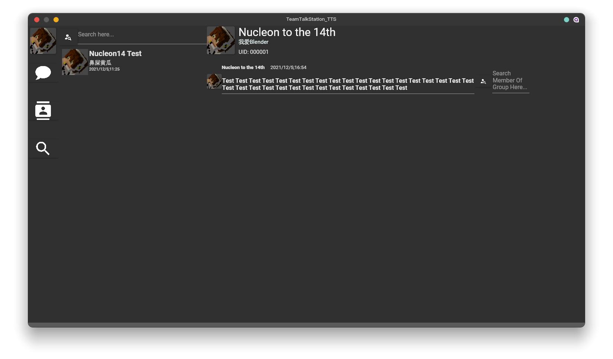

# TeamTalkStation-TTS #

**TeamTalkStation-TTS** is a ***free and open source*** teamwork system project based on BSD-3 Clause License

This project includes both server(developing) and client

### TeamTalkStation-TTS_Client Effect Image

### TeamTalkStation-TTS Project Technology Stack ### 

- [.NET](https://dotnet.microsoft.com/)
- [AvaloniaUI](http://avaloniaui.net/)

## Libraries Requires ## 

+ Linux

  + libgdiplus

    

+ Windows

  + None

    

+ MacOS

  + None

    

## Runtimes ##

+ .NET 6 runtime
+ .NET 6 SDK
